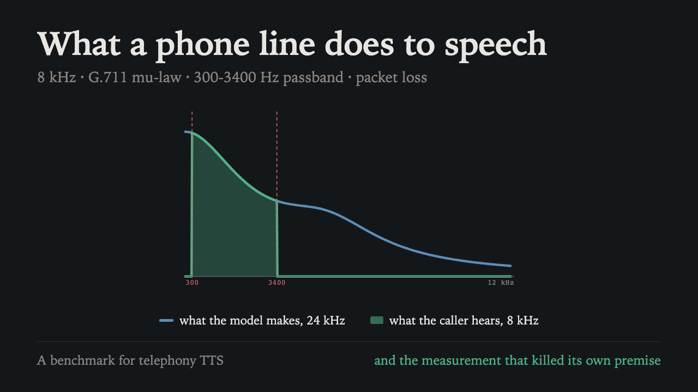
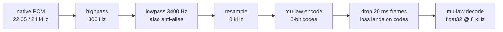

<div align="center">

# DialTone

**A benchmark for text to speech that has to survive a phone line.**

8 kHz · G.711 mu-law · 300-3400 Hz passband · packet loss

[](https://github.com/mahimairaja/DialTone-TTS/actions/workflows/ci.yml)
[](packages)
[](docs/REPRODUCING.md)
[](pyproject.toml)
[](LICENSE)

[Watch the explainer](https://youtu.be/xuxqGpFmadI) ·
[Findings](docs/baseline-findings.md) ·
[Reproducing](docs/REPRODUCING.md) ·
[Data card](DATA_CARD.md)

</div>

---

Most text to speech is built for 24 kHz headphones and evaluated there. Then it gets
squeezed down a telephone line. This measures what that squeeze actually costs.

It was started to justify building a telephony-native vocoder. **The measurement says
that vocoder is not worth building**, at least not for intelligibility, so it was not
built. The benchmark is the result.

<div align="center">

[](https://youtu.be/xuxqGpFmadI)

*Five minutes: what a phone line does to speech, the scoring bug that nearly
invalidated the benchmark, and the measurement that killed the design it was meant to
validate.*

</div>

## The result

Two systems, 300 utterances, four conditions, reproducible to 0.0 percentage points,
and listened to.

| System | wideband | **clean** | loss 1% | loss 3% | latency p50 | hardware |
| :--- | ---: | ---: | ---: | ---: | ---: | :--- |
| `piper +det` | 3.48 | **3.06** | 3.13 | 3.24 | **158 ms** | CPU |
| `zipvoice_distill +det` | 4.68 | 4.27 | 4.34 | 4.30 | 342 ms | A10G |

Word error rate, lower is better. `wideband` is the pre-codec control.

### 1. The phone line does not cost intelligibility. It improves it

Both systems score **0.41 points better** after the G.711 chain than before it. On
both, `datetime_money` carries it: 9 errors to 1 for Piper, 38 to 27 for ZipVoice.

Two unrelated architectures, the same improvement, the same category. That points at
the recogniser rather than either model: band-limiting to 300-3400 Hz removes
high-frequency content that faster-whisper trips over on times and amounts.

### 2. Chunking at punctuation is strictly harmful

It saves about 30 ms on time to first audio and costs about 680 ms on total
generation. A non-autoregressive model's per-call cost barely depends on text length,
so splitting a turn into three chunks pays that cost three times. Realtime factor is
3.8x to 4.9x, not the ~150x the design assumed.

### 3. The small CPU model wins on both axes

Piper beats a 123M flow-matching model on GPU by 1.21 points of word error rate and by
more than double on latency, at no GPU cost. ZipVoice's advantage is voice cloning,
which this benchmark does not score.

## The chain

The only implementation of the telephony chain in this repository. `dialtone` imports
it rather than reimplementing it, so training and evaluation conditions cannot drift
apart.



Band-limiting runs at the native rate: the 3400 Hz lowpass already sits below the
8 kHz Nyquist, so it doubles as the anti-alias filter. It is an 8th-order Butterworth
cascade with per-section Q, because a single biquad leaves a 6 kHz tone only 10.9 dB
down and no carrier would ship that.

Loss is applied **after** encoding, because a network drops packets and a packet
carries codes. Dropping samples first would model something that does not happen.

## Layout

| Package | What it does |
| :--- | :--- |
| `handset-bench` | The benchmark. Synthesises a frozen 300-utterance text set, pushes it through the codec chain, transcribes it, and scores word error rate and latency per condition |
| `dialtone` | Corpus tooling: licence gating, the frozen split, provenance. Also an untrained narrowband vocoder, kept because the differentiable codec layer in it is useful on its own |

`handset-bench` does not import `dialtone`, enforced by a test. The benchmark has to be
able to score a system it knows nothing about, so the dependency only runs one way.

**No vocoder has been trained.** The code in `packages/dialtone/src/dialtone/vocoder/`
is architecture and a differentiable codec layer, verified by tests, with no training
run and no checkpoint behind it. It stayed that way deliberately: the measurement above
removed the case for training it.

## Running it

Requires [uv](https://docs.astral.sh/uv/) and a logged-in [Modal](https://modal.com)
CLI.

```bash
uv sync --all-packages

./scripts/run_baseline.sh                       # smoke run, 12 utterances, ~$0.45
./scripts/run_baseline.sh --full                # all 300
./scripts/run_baseline.sh --full --skip-ingest  # corpus already on the Volume, ~$4.45
```

The first run downloads roughly 10 GB of LibriTTS-R and walks about 44,000 files on a
network volume: budget 30 to 60 minutes for that stage alone. Everything after it
caches on Modal Volumes, so later runs pass `--skip-ingest`. The matrix refuses to
launch when its own cost estimate exceeds `--max-cost`.

Outputs land in `results/`, which is not tracked. What survives a run lives in
`baselines.yaml` and in `docs/`.

```bash
./scripts/fetch_samples.sh          # pull audio for the manual listening gate
uv run handset-bench rescore        # re-score stored transcripts, no GPU
```

## Reproducibility

Two consecutive runs of the same system produced **1,200 identical transcripts**, so
the band is 0.0 points.

Getting there took one fix. Both Piper and ZipVoice sampled noise per call and produced
different audio every run, so the benchmark was comparing transcripts of *different
recordings* while nothing looked wrong. Version strings now carry `+det` or `+sampled`,
because the waveform differs between them, and records store their transcripts so a
scoring change is re-scored offline instead of re-running the matrix.

[docs/REPRODUCING.md](docs/REPRODUCING.md) lists everything pinned and why.
[DATA_CARD.md](DATA_CARD.md) records corpus provenance, including which corpora were
excluded on licence grounds.

One gate is manual and is never passed by a script: listening to a sample per system
per condition. A word error rate can look plausible while the audio is broken. Both
systems have passed it.

## Licence

MIT. See [LICENSE](LICENSE). Corpus is LibriTTS-R under CC BY 4.0.
